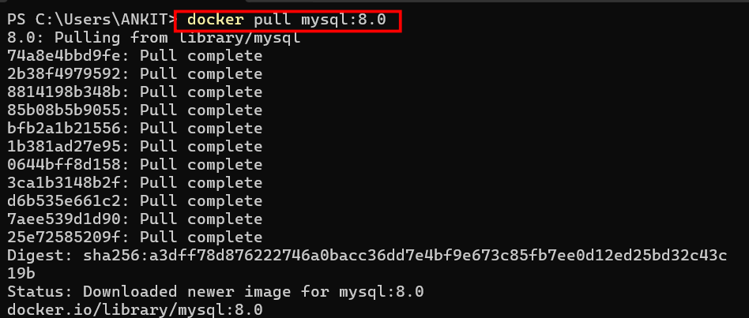
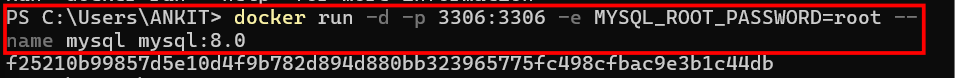
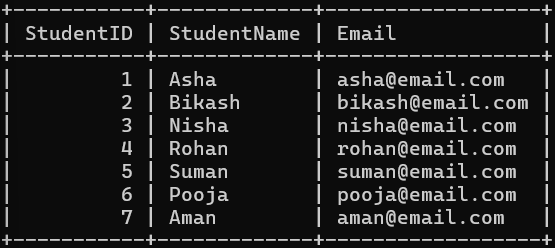
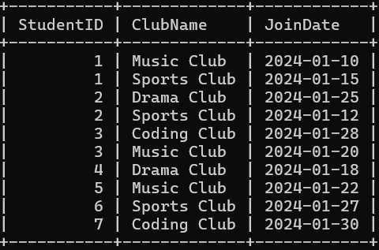
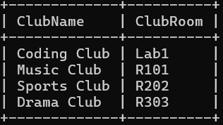

# Normalisation
Normalization is the process of organizing your data in a database to remove redundancy and ensure consistency. It's like reorganizing that notebook into a structured filing system where each piece of information is stored in exactly one place.

In technical terms: normalization is a systematic approach to decomposing tables with anomalies into smaller, well-structured tables that follow specific rules. The result is a database where data is stored efficiently, reliably, and without unnecessary duplication.
# 
# Tools used
1. Docker 
2. Myql


# steps to create a Mysql server in the docker for normalisation.

## Step 1: we have to pull the image of mysql in the docker.
To do that first we have to open the powershell or cmd and run docker in the background. After that we have to enter the below command in the powershel.
```text
docker pull mysql:8.0
```


## step 2: Running the image in the docker:
After pulling the image we have to run it in the docker:
```text
 docker run -d -p 3306:3306 -e MYSQL_ROOT_PASSWORD=root --name mysql mysql:8.0
```



## Step 3: Executing the mysql
After running the image we have to execute it. for that we have to enter this command:
```text
 docker exec -it mysql mysql -u root -p
  ```


Now our mysql server is ready. We can use it to normalise the table.

## Normalising the table in 1NF
We dont have to normalise the table into 1NF because it is already in the 1NF form. 


## Normalizing the table into 2NF. 
 In order to normalize the table into 2NF form. we have to make sure that the Each attribute in the table must depend upon the whole key, not just part of it.
  So we must first create a Students table because StudentName and their email depend upon Student.
```text
StudentID   PRIMARY KEY,
StudentName   VARCHAR,
Email         VARCHAR   
```



After that we have to create another table named Clubs to seperate Clubroom, clubname and clubmentor. It is so because Clubroom and clubMentor depends upon the clubname.
```text
ClubName    PRIMARY KEY,
ClubRoom     VARCHAR,
ClubMentor   VARCHAR
```


At last we have to create a Registrations table which will link Student to Clubs. The data in this table will depend upon both Students and CLub.
```text
(StudentID, CLubname)    PRIMARY KEY
StudentID                 FOREIGN KEY
Students(StudentID)       REFERENCES
Clubname                  FOREIGN KEY
Clubs(Clubname)           REFERENCES
```


## Normalizinf the table in 3NF.
There are still some transitive dependency left in the table. So we must remove those deoendenct to make the table in 3NF form. In order to do that first we have to create a staff table because the clubmentor attribute in the club table actually depended upon the clubroom not clubname.So we moved the clubmentor to the staff table. Which removed the transitive dependency.


Then the Clubs table changes to:



Now when we combine all the four table as one. It becomes like this.


